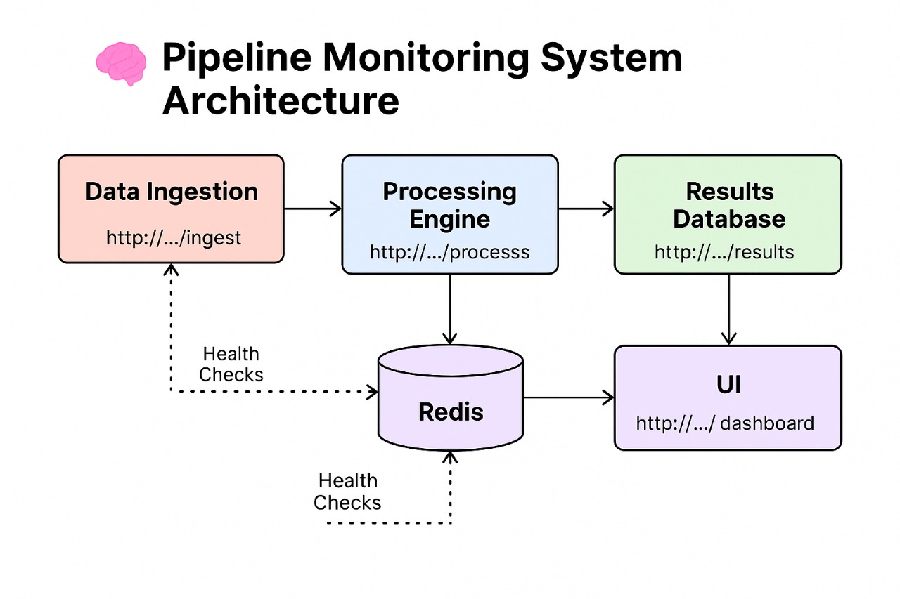

# Distributed Data Pipeline Monitor

This project is a Dockerized microservices system that demonstrates:

- Real-time data ingestion  
- Fault-tolerant processing via Redis  
- Centralized pipeline health monitoring  
- A live frontend dashboard with alerts  
- Auto-ingestion using the EmojiHub API (yes, emojis!)

---

## Architecture Overview

### Microservices

1. **Data Ingestion Service**  
   - Accepts JSON via `/ingest`
   - Validates schema, applies rate limiting
   - Publishes to Redis
   - Auto-ingests emoji data every 10s

2. **Processing Engine Service**  
   - Subscribes to Redis pub/sub
   - Enriches, timestamps, and stores results
   - Exposes `/results/{id}` and `/results` endpoints

3. **Pipeline Monitor Service**  
   - Pings each service every 10 seconds via `/health`
   - Logs results and exposes:
     - `/dashboard` – current system state
     - `/healthlog` – full check history
   - Triggers UI alerts when any service goes down

4. **UI Frontend**  
   - Built in React
   - Displays:
     - Stored results
     - Health dashboard
     - Health logs
     - Auto-alerts (no refresh needed)

---

## ⚙️ Tech Stack

- Python (Flask)
- Redis (Pub/Sub)
- Docker + Docker Compose
- React.js
- EmojiHub API 🧑‍🎤
---

## 🚀 How to Run

```bash
docker-compose up --build
````

Then open:

* **UI** → [http://localhost:3000](http://localhost:3000)
* **Data Ingestion** → [http://localhost:5001](http://localhost:5001)
* **Processing Engine** → [http://localhost:5002](http://localhost:5002)
* **Monitor Dashboard** → [http://localhost:5003/dashboard](http://localhost:5003/dashboard)
* **Health Log** → [http://localhost:5003/healthlog](http://localhost:5003/healthlog)

---

## 🧪 Demo Features

* 🔄 Live emoji ingestion from `https://emojihub.yurace.pro/api/random`
* Health checks logged every 10s
* Auto alerts if any service fails
* View all processed data by UUID or full list

---

## Demo Preview


## Architecture Diagram




## ✅ Features Implemented

* Resilient data ingestion with retry and rate limit
* Real-time Redis message passing
* Service health check monitor with full logs
* Live UI with no-refresh alerts
* Dockerized microservice deployment


## 👨‍💻 Author
Built by Aryan


